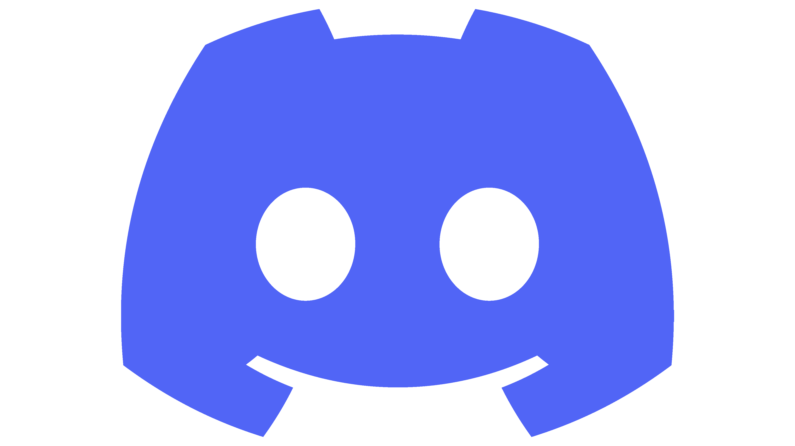

## **Hello my name is Luis Sanchez and welcome to my profile**

Hello, my name is Luis Sanchez, I am currently studying high school in the programming career, I consider myself self-taught because I learned most of my knowledge on my own, my career only helped me to understand the bases and logic of programming.

I currently consider myself a junior developer with knowledge in the following languages:

- Go - Low Level
- PHP - Low Level
- SQL - Low Level
- CSS - Low Level
- C++ - Low Level
- JavaScript - Low Level
- Java - Intermediate Level
- HTML - Intermediate Level
- Python - Intermediate Level

Two of my future plans are to get into video game programming and machine learning.

Curious facts

- 🌱 I am currently learning the necessary technologies to be Full-Stack
- 🌐 My [website](https://lobilux.me) (_Developing_)

---

- 📫 Contact:

  -  Discord LobiLux#5960 (_More Activity_)
  -  Email <a href="mailto:luis.sanchezz.vazquezz@gmail.com">luis.sanchezz.vazquezz@gmail.com</a>
  -   Twitter [@LobiLuxUwU](https://twitter.com/LobiLux_UwU)

---

  
 📌 <b>My Github Stats</b>: 

   
  

    
    
  

